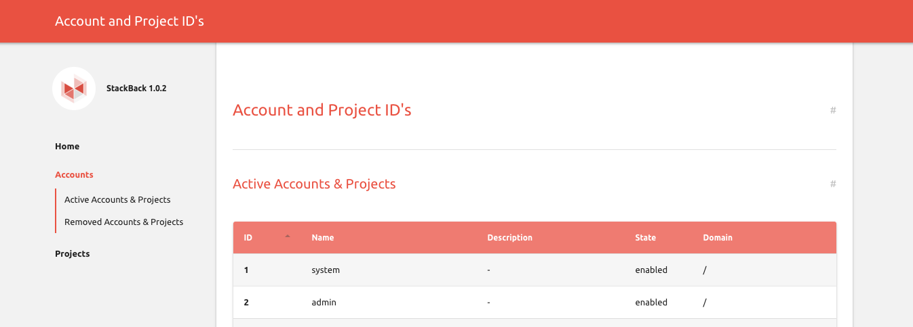

# StackBack

Generate HTML pages with information from the CloudStack database, not available using API commands, using Hugo.

Currently implemented is a list of of accounts and projects.



## Setup

Install Hugo:
https://gohugo.io/getting-started/installing/

Install Ruby dependencies
```bash
$ bundle install
```

Download a hugo theme:
```bash
$ git clone https://github.com/digitalcraftsman/hugo-material-docs.git themes/hugo-material-docs
```

Setup a .env file on the same level as the script named ".env" and set the following variables:
```bash
# Access to the CloudStack database
CS_DB_HOST=mycloudstack-database.int
CS_DB_USER=root
CS_DB_PASSWORD='***********'
```

## Generate JSON data from ClouStack database

You can generate JSON data files using the included Ruby script:

Generate accounts.json:
```bash
$ ./cloudstack.rb accounts > data/accounts.json
```

Generate projects.json:
```bash
$ ./cloudstack.rb projects > data/projects.json
```

## Run in development mode

Start hugo in dev mode:

```bash
$ hugo server                                                                            
...
Serving pages from memory
Web Server is available at http://localhost:1313/ (bind address 127.0.0.1)
Press Ctrl+C to stop
```

## Deploy the static website

  1. Configure the base URL within config.toml: `baseURL = "http://example.org/"`
  2. Deploy the the static site using rsync - one of many possible deployment options:
```bash
$ hugo
$ rsync -avz --delete public/ root@static-01.stxt.media.int:/data/stackback
```
